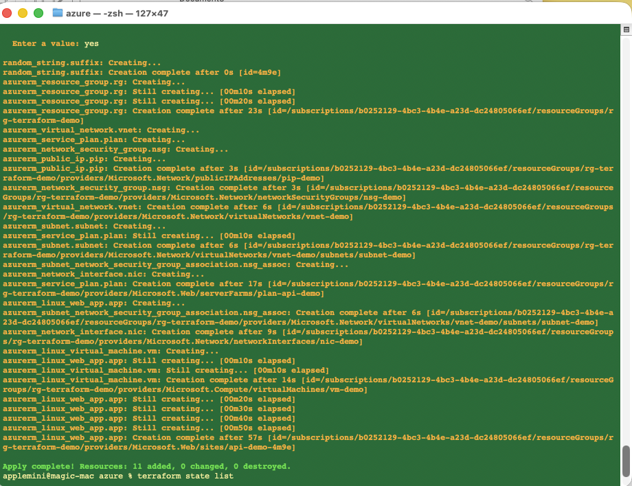
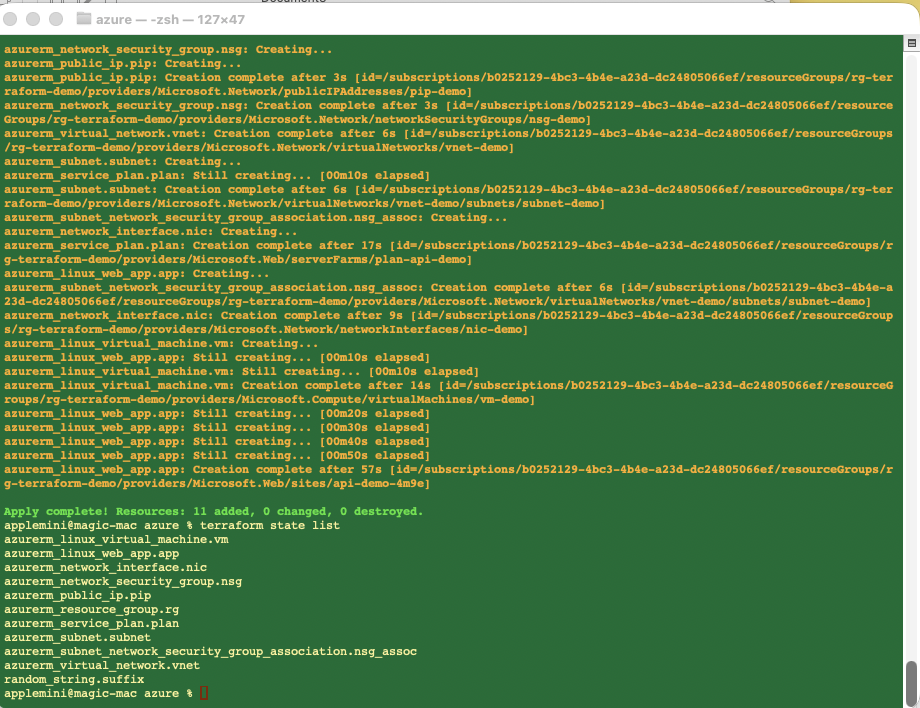
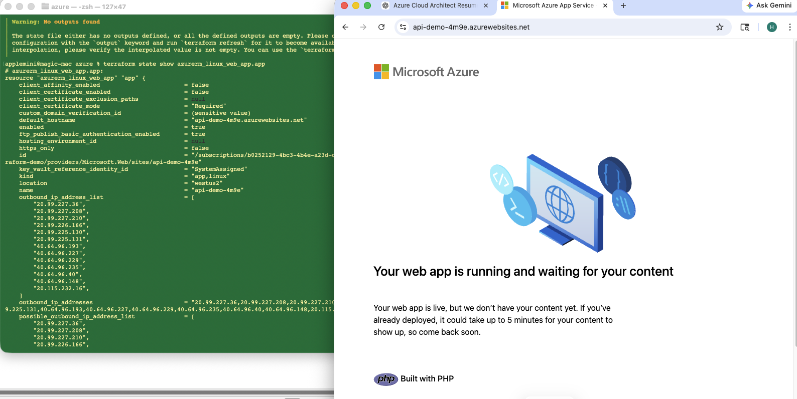
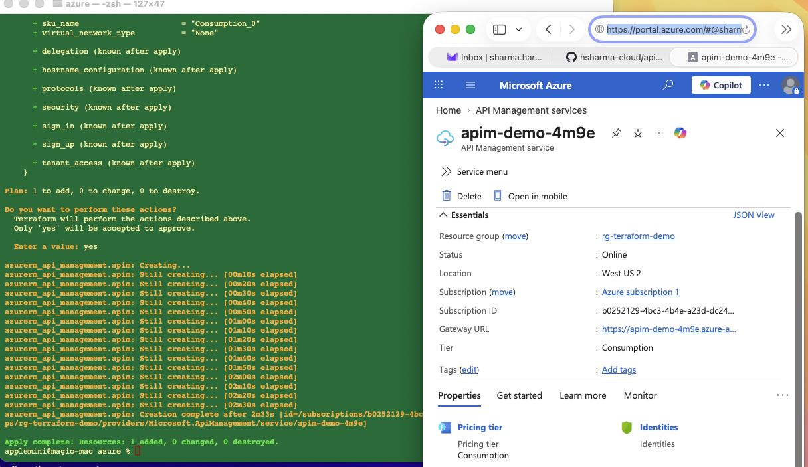
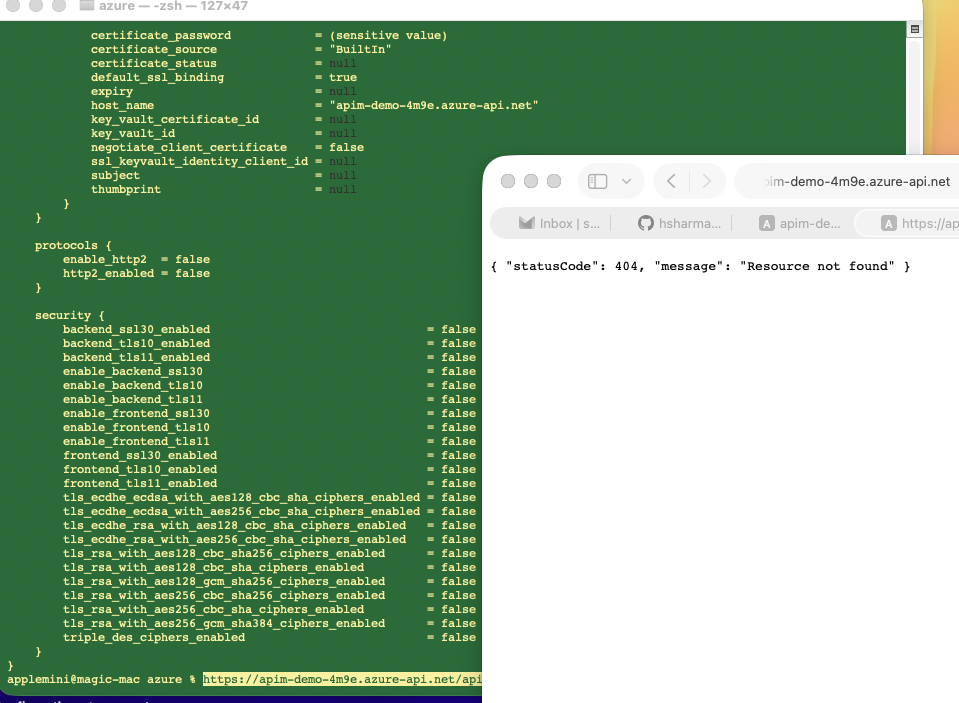
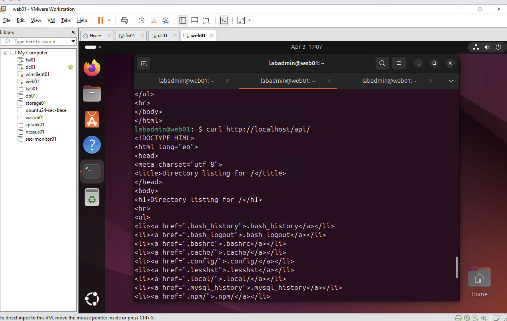
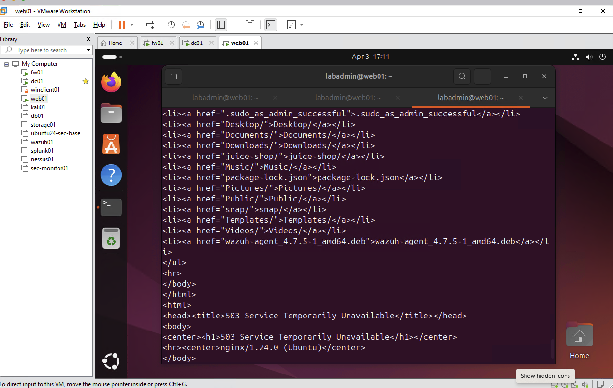

# 🔐 API Security Guardrails (Cross-Platform)

This project demonstrates how API security guardrails can be implemented across **Azure and On-Prem environments** using consistent security principles.

---

## 🎯 Objective

To design and implement API security controls that:

- Enforce **authentication and access control**
- Apply **rate limiting to prevent abuse**
- Enable **monitoring and detection**
- Protect backend services through **layered architecture**

---

## 🧠 Core Concept

Regardless of platform, API security follows the same pattern:

Client → API Gateway → Authentication → Rate Limiting → Backend → Logs → Alerts

---

## ☁️ Azure Implementation

**Services Used:**
- Azure API Management (APIM)
- Azure App Service (backend API)
- Azure AD (optional authentication)
- Azure Monitor

**Guardrails Applied:**
- API gateway enforcement using APIM
- Rate limiting policies
- Centralized monitoring and logging
- Optional identity integration

---
## Screenshots

## 🏢 On-Prem Implementation

**Technologies Used:**
- NGINX (reverse proxy / API gateway)
- Linux server (Ubuntu)
- Firewall rules
- System logging

**Guardrails Applied:**
- Reverse proxy for API control
- Rate limiting at NGINX layer
- Network segmentation via firewall
- Log monitoring using system logs

---

## 🛡️ Security Guardrails Summary

| Control            | Azure                   | On-Prem              |
|------------------|------------------------|----------------------|
| API Gateway       | API Management         | NGINX / Reverse Proxy|
| Authentication    | Azure AD               | AD / LDAP / Basic Auth|
| Rate Limiting     | APIM Policies          | NGINX Limit Req      |
| Monitoring        | Azure Monitor          | Logs / SIEM          |
| Network Control   | NSG / Private Endpoint | Firewall             |

---

## 🏗️ Architecture Overview

### Azure
Client → API Management → App Service → Azure Monitor

### On-Prem
Client → Firewall → NGINX → API Server → Logs

---

## 🧪 Testing Approach

- Verified successful API responses
- Simulated traffic load for rate limiting
- Observed logging and monitoring behavior

---
## 📸 Screenshots

### On-Prem (NGINX API Guardrails)

**Architecture**

Client → Firewall → NGINX → API Server → Logs

---

**API Access via NGINX**

The API is successfully exposed through the NGINX reverse proxy.

---

**Rate Limiting Enforcement**

NGINX enforces rate limiting to control excessive traffic.  
High request volume results in HTTP 503 responses.

---

## 💡 Key Takeaways

- API security is **platform-independent**
- Guardrails rely on **layered defense**
- Monitoring and detection are critical
- Security design applies across environments

---

## 🚀 Future Improvements

- Add WAF (Azure / ModSecurity)
- Implement JWT authentication
- Integrate centralized logging (SIEM)
- Extend to hybrid architecture

---

## 🧠 Author Notes

This project demonstrates how consistent API security principles apply across cloud and on-prem environments.

